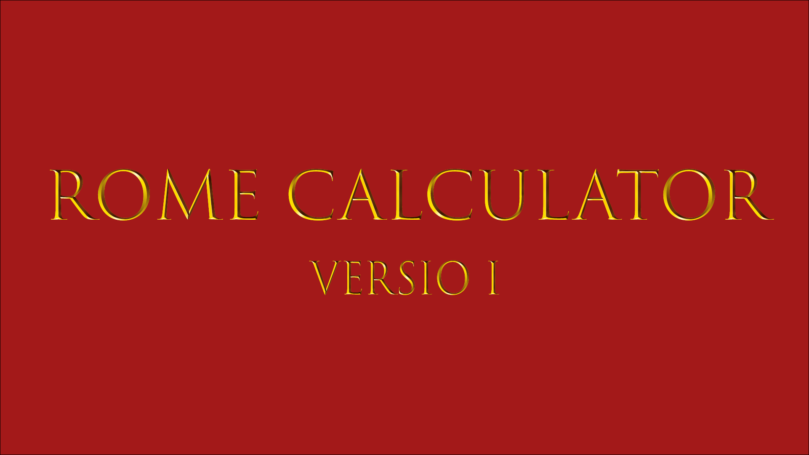

<a name="readme-top"></a>

<!-- PROJECT LOGO -->
<br />
<div align="center">
  <a href="https://github.com/LiveInside/calculator-rome-and-arab/tree/master">
    
  </a>

<h3 align="center">ROME CALCULATOR</h3>
  <p align="center">
    Это лучший калькулятор римских чисел ! :smile:
  </p>
</div>


<!-- TABLE OF CONTENTS -->
<details>
  <summary>Навигация</summary>
  <ol>
    <li><a href="#о-приложении">О приложении</a></li>
    <li><a href="#запуск-приложения">Запуск приложения</a></li>
    <li><a href="#использование">Использование</a></li>
    <li><a href="#дорожная-карта">Дорожная карта</a></li>
    <li><a href="#контакты">Контакты</a></li>
  </ol>
</details>


<!-- ABOUT THE PROJECT -->
## О приложении



Данное приложение предназначено для осуществления вычислений с римскими числами значение которых не превышает **10** (_рим._ **X**).

Поддерживаемые операции:
* Сложение (оператор `+`)
* Вычитание (оператор `-`)

<!-- GETTING STARTED -->
### Запуск приложения

Для запуска приложения необходимо запустить файл "Calculator.jar".

_Далее показаны шаги по запуску приложения._

1. Для запуска файла "Calculator.jar" необходимо выполнить следующую команду в консоли.
    ```shell
    java -jar Calculator.jar Rome
    ```
   _`Rome` - представляет параметр командной строки, который указывает на то, какой тип калькулятора будет запущен. Регистр не важен._


2. Для выполнения команды необходимо находиться в той же директории, в которой находится файл. Проверьте путь прописанный в консоли.

   _Пример:_
   ```shell 
   D:\Projects IDEA\RomeCalculator\out\artifacts\Calculator_jar> java -jar Calculator.jar Rome
   ```
   **Примечание: У вас должен быть свой путь. Для перехода между директориями используете команду `cd`.**


3. Проверьте наличие файла в директории командой `ls`.
   ```shell
   D:\Projects IDEA\RomeCalculator\out\artifacts\Calculator_jar> ls
   ```
   _Пример ответа:_
   ```shell
   Каталог: D:\Projects IDEA\RomeCalculator\out\artifacts\Calculator_jar


   Mode                 LastWriteTime         Length Name
   ----                 -------------         ------ ----                                                                                                                                                                                                                                                                 
   -a----        30.08.2023     15:01          10381 Calculator.jar
   ```

<p align="right">(<a href="#readme-top">back to top</a>)</p>


<!-- USAGE EXAMPLES -->
## Использование

Вы можете подавать на вход два римских числа и один оператор из двух(`+` или `-`). Программа вернёт ответ в виде римского числа.

_Пример:_
```
   Ввод: I + II
   Ответ: III
```

_Далее представлены шаги по использованию программы._

1. При запуске программы вас встречает краткое описание программы и пример её работы.
   ```shell
   D:\Projects IDEA\RomeCalculator\out\artifacts\Calculator_jar> java -jar Calculator.jar Rome
   Это калькулятор римских чисел. Он может складывать и вычитать римские числа
   Пример ввода: I + II
   Пример вывода: III
   Также при использовании данного калькулятора следует помнить о том, что среди римских чисел нет отрицательных и нуля.
   Вместо нуля используется N от рим. nulla
   Ввод:
   ```
2. Введите первое число, затем знак оператор, второе число и нажмите `Enter` на клавиатуре. ___Между числами и знаком обязательно должен стоять пробел.___
   ```shell
   D:\Projects IDEA\RomeCalculator\out\artifacts\Calculator_jar> java -jar Calculator.jar Rome
   Это калькулятор римских чисел. Он может складывать и вычитать римские числа
   Пример ввода: I + II
   Пример вывода: III
   Также при использовании данного калькулятора следует помнить о том, что среди римских чисел нет отрицательных и нуля.
   Вместо нуля используется N от рим. nulla
   Ввод: V + III
   Ответ: VIII
   Ввод:
   ```
3. При вводе неверного оператора или числа(_например вместо римских арабские чисел или буквы_) программа завершится с ошибкой.
   ```shell
   Ввод: I * II 
   Exception in thread "main" org.calculator.exception.UnsupportedOperator: Supported operators only "+" and "-"
   ```
   
4. При вводе когда результат является отрицательным, программа вернёт `N` и сообщение о том, что в римской системе счисления нет отрицательных чисел, но работу не завершит.
   ```shell
   Ввод: I - II
   Answer: N
   There are no negative numbers in Roman numerals
   Ответ: N
   Ввод:
   ```
5. Программа имеет ограничение. На ввод могут подаваться римские числа значение которых не превышает **10** (_рим._ **X**). При вводе числа значение которого превышает 10 программа завершится с ошибкой.
   ```shell
   Ввод: XX + X
   Exception in thread "main" org.calculator.exception.IncorrectInput: Correct numbers only: roman I-X
   ```
<p align="right">(<a href="#readme-top">back to top</a>)</p>

<!-- ROADMAP -->
## Дорожная карта

- [x] Добавлен калькулятор римских чисел
- [ ] Добавлен калькулятор арабских чисел
   - [ ] Добавлена операция умножения `*`
   - [ ] Добавлена операция деления `\ `
   - [ ] Добавлена операция нахождения остатка `%`
<p align="right">(<a href="#readme-top">back to top</a>)</p>

<!-- CONTACT -->
## Контакты

Ссылка на проект: [https://github.com/LiveInside/calculator-rome-and-arab](https://github.com/LiveInside/calculator-rome-and-arab)

<p align="right">(<a href="#readme-top">back to top</a>)</p>